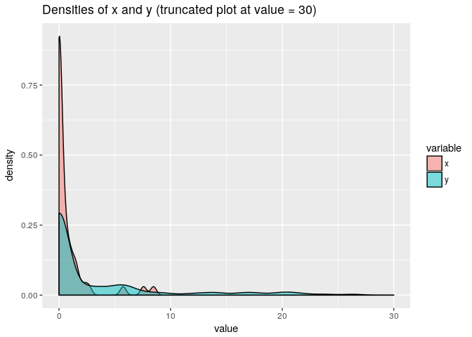

rbtt (Robust bootstrap-based *t*-test)
======================================

Overview
--------

**rbtt is an alternative bootstrap-based *t*-test aiming to reduce
type-I error for non-negative, zero-inflated data**

Tu & Zhou (1999) showed that comparing the means of populations whose
data-generating distributions are non-negative with excess zero
observations is a problem of great importance in the analysis of medical
cost data. In the same study, Tu & Zhou discuss that it can be difficult
to control type-I error rates of general-purpose statistical tests for
comparing the means of these particular data sets. This package allows
users to perform a modified bootstrap-based t-test that aims to better
control type-I error rates in these situations.

Usage
-----

Let's say we have some non-negative data with clumping at zero:

    x <- rbinom(50, 1, 0.5) * rlnorm(50, 0, 1)
    y <- rbinom(150, 1, 0.3) * rlnorm(150, 2, 1)

Then we may compute rbtt-based *t*-tests to compare the means:

    # Use ‘method = 1’ for a two-sample, two-sided rbtt under the equal variance assumption,
    rbtt(x, y, n.boot=999, method = 1)

    ## 
    ##  Two-sided robust bootstrapped t-test assuming equal variance
    ## 
    ## data:  x and y
    ## t = -2.1, p-value = 0.02
    ## alternative hypothesis: true difference in means is not equal to 0
    ## 95 percent confidence interval:
    ##  -3.6203 -0.1577
    ## sample estimates:
    ## mean of x mean of y 
    ##    0.9264    3.1507

    # Use ’method = 2' for a two-sample, one-sided rbtt without the equal variance assumption
    rbtt(x, y, n.boot=999, method = 2)

    ## 
    ##  One-sided robust bootstrapped t-test not assuming equal variance
    ## 
    ## data:  x and y
    ## t = -3.4, p-value = 0.004
    ## alternative hypothesis: true difference in means is less than 0
    ## 95 percent confidence interval:
    ##  -3.6906 -0.7581
    ## sample estimates:
    ## mean of x mean of y 
    ##    0.9264    3.1507

Alternatively, you can specify `method = "both"` to perform both methods
simultaneously (this is also done by default).

Parallelize rbtt
----------------

    # Compare speed when using single-core versus multiple-core rbtt on 99999 bootstrap resamples
    system.time(rbtt(x, y, n.boot = 99999, method = 1, n.cores = 1))

    ##    user  system elapsed 
    ##   7.945   0.012   7.992

    system.time(rbtt(x, y, n.boot = 99999, method = 1, n.cores = 3))

    ##    user  system elapsed 
    ##   6.482   0.083   3.772

Comparison between rbtt and t.test
----------------------------------

First, we perform some simulations.

    n.sim <- 999

    t.test.results <- numeric(n.sim)
    rbtt.results <- numeric(n.sim)

    pval.table.list <- mclapply(1:n.sim, function(i)
    {
      # True means are equal
      x <- rbinom(50, 1, 0.5) * rlnorm(50, 1.15, 1)
      y <- rbinom(150, 1, 0.5) * rlnorm(150, 1.15, 1)
      
      t.test.result <- t.test(x, y)$p.value
      rbtt.result <- rbtt(x, y, n.boot = 999, method = 1)$p.value
      
      return(c(t.test.result, rbtt.result))
    }, mc.cores = 4)

    pval.table <- do.call(rbind, pval.table.list)

Now, let's evaluate the type-I error of these simulations using a
significance level of 0.05.

    # t.test type-I error with significance level of 0.05:
    sum(pval.table[,1] < 0.05) / n.sim

    ## [1] 0.06206

    # rbtt type-I error with significance level of 0.05:
    sum(pval.table[,2] < 0.05) / n.sim

    ## [1] 0.05005

More accurate p-values and type-I error estimates can be obtained by
increasing `n.boot` and `n.sim`, respectively

Contributors
------------

-   Ian Waudby-Smith (University of Waterloo)

-   Dr. Pengfei Li (University of Waterloo)
